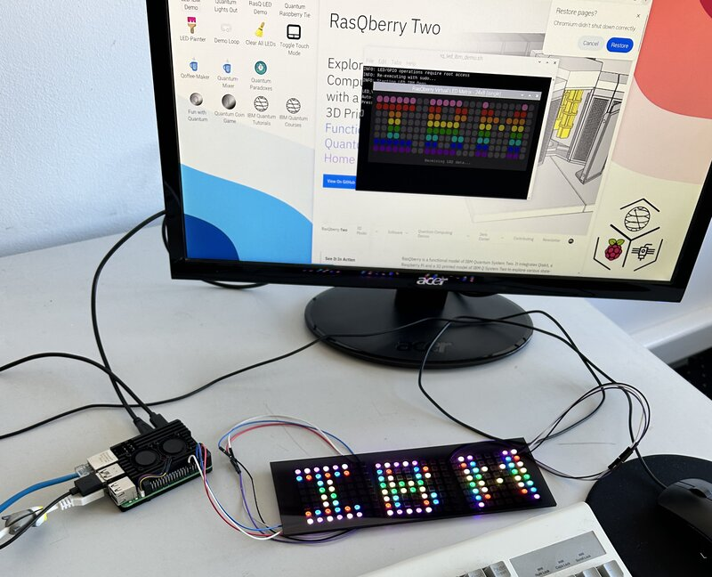

# 3x WS2812B-64 (8x8) Panel Adaptation for RasQberry-Two



*The image above shows the incorrect LED addressing that occurs when running
RasQberry-Two demos on 3x 8x8 WS2812B panels without this adaptation — the
pixel mapping is wrong because the original code assumes a different panel
layout.*

Adapts [RasQberry-Two](https://github.com/JanLahmann/RasQberry-Two) LED demos
for **3 daisy-chained WS2812B-64 8x8 panels** instead of the original quad 4x12
panel layout.

Works with the pi-gen system image from the `development`/`beta` branches.

## Quick start

```bash
git clone https://github.com/barkol/rasqberry-3x8x8-led-adaptation.git
cd rasqberry-3x8x8-led-adaptation
sudo bash apply.sh
```

All LED demos (text scrolling, logos, LED Painter, IBM demo) and the virtual
LED display will use the correct mapping.

## What's in the repo

| File | Purpose |
|---|---|
| `apply.sh` | Install script (run with sudo) |
| `rq_led_utils_3x8x8.py` | Patched LED utils with `triple_8x8` layout |
| `rq_led_virtual_gui_3x8x8.py` | Patched virtual LED GUI with `triple_8x8` mapping |
| `LED_array_indices_3x8x8.py` | Pixel index map for LED Painter |
| `neopixel_spi_IBMtestFunc_3x8x8.py` | Adapted IBM logo demo (standalone, SPI) |
| `diagnose_wiring.py` | Interactive diagnostic to verify panel wiring |

## What apply.sh does

1. Sets `LED_MATRIX_LAYOUT=triple_8x8` and `LED_MATRIX_Y_FLIP=false` in
   `/usr/config/rasqberry_environment.env`
2. Installs patched `rq_led_utils.py` to `/usr/bin/`
3. Replaces `LED_array_indices.py` in the LED Painter directory (if installed)
4. Installs patched `rq_led_virtual_gui.py` to `/usr/bin/`
5. Copies the adapted IBM demo to `/usr/bin/`

Backups of all replaced files are saved with a `.bak-quad` suffix.

### Options

```bash
sudo bash apply.sh              # Apply the adaptation
sudo bash apply.sh --dry-run    # Preview changes without modifying anything
sudo bash apply.sh --revert     # Restore original files from backups
```

## Wiring

Daisy-chain three panels left-to-right. Data pin: GPIO 10 (SPI MOSI) for
standalone SPI demos, or GPIO 18 (PWM/PIO) for system demos via `rq_led_utils`.

```
RPi --> [Panel 0 DIN] [DOUT] --> [Panel 1 DIN] [DOUT] --> [Panel 2 DIN]
```

### Panel pixel layout

Each WS2812B-64 panel uses **progressive** (non-serpentine) row wiring — all
rows go left to right. Panels are mounted upside-down, so physical pixel 0
is at the **bottom-left** when viewed from the front. The mapping flips Y
to compensate.

```
Physical wiring (before Y flip):

Row 0 (bottom):  0 ->  1 ->  2 ->  3 ->  4 ->  5 ->  6 ->  7
Row 1:           8 ->  9 -> 10 -> 11 -> 12 -> 13 -> 14 -> 15
...
Row 7 (top):    56 -> 57 -> 58 -> 59 -> 60 -> 61 -> 62 -> 63
```

Three panels form a single 8-row x 24-column grid (192 pixels):

- Panel 0: pixels 0-63 (columns 0-7)
- Panel 1: pixels 64-127 (columns 8-15)
- Panel 2: pixels 128-191 (columns 16-23)

### Mapping formula

```python
panel = x // 8
col_in_panel = x % 8
flipped_y = 7 - y
pixel_index = panel * 64 + flipped_y * 8 + col_in_panel
```

## LED Painter note

The LED Painter is installed on first launch (via `rq_led_painter.sh` or the
desktop icon). If you run `apply.sh` before the Painter is installed, that
step is skipped. Re-run `sudo bash apply.sh` after installing the Painter.

## Diagnosing wiring issues

If the display looks wrong, run the diagnostic script to observe the physical
pixel order on your panels:

```bash
/home/rasqberry/RasQberry-Two/venv/RQB2/bin/python3 diagnose_wiring.py
```

It runs 5 interactive tests (panel boundaries, pixel direction, corners, rows,
full sweep) and prints questions to help identify the wiring pattern. No sudo
needed (uses SPI).

## Differences from original

| | Original (RasQberry-Two) | This adaptation |
|---|---|---|
| Panels | 4x 4x12 (quad) or single column-serpentine | 3x 8x8 (progressive rows) |
| Total pixels | 192 | 192 |
| Serpentine | Yes (column or row) | No (all rows left-to-right) |
| Y flip | Via `LED_MATRIX_Y_FLIP` env var | Built into mapping formula |
| Layout config | `single` or `quad` | `triple_8x8` |
